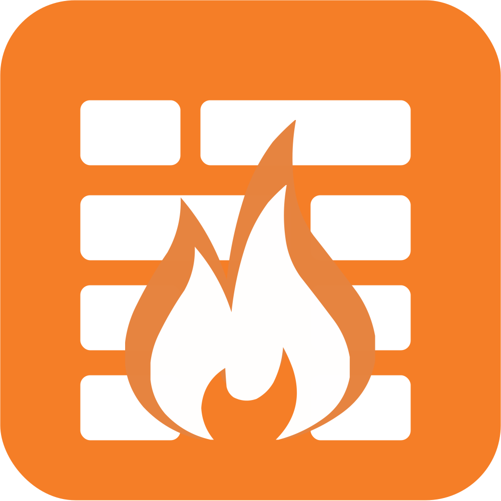
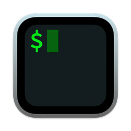

## ZoneTwelve Here

I love to be a Maker, System designers, Software engineers, Information security researchers and innovative educators.

If you are interest about my research, here is my [Blog](https://blog.zonetwelve.io), not often updte.

About often, I often use:

|  |  |  |  |   |  |  |  |  |
| :---------------: | :---------------: | :---------------: | :---------------: | :---------------: | :---------------: | :---------------: | :---------------: | :---------------: |
| Node.js | Git | iptables | Linux | Virtualize  | Shell Script | Terminal | Cloud | Database |

<small>Latest update: 2023/04/07</small>